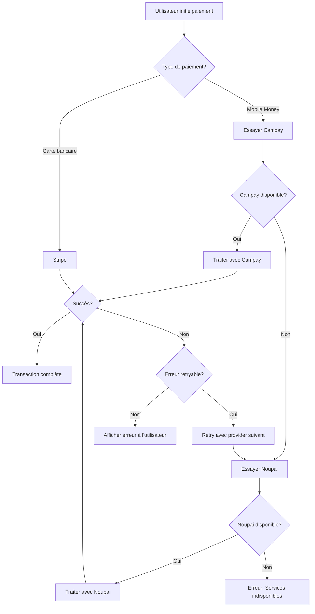

# 💳 Système de Paiement Complet - Ma'a yegue

## Vue d'ensemble

Implémentation d'un système de paiement robuste avec:
- **Campay** (Mobile Money Cameroun - Priorité 1)
- **Noupai** (Mobile Money Cameroun - Fallback/Priorité 2)
- **Stripe** (Cartes bancaires internationales - Priorité 3)
- Gestion automatique des pannes (fallback)
- Gestion des erreurs (solde insuffisant, timeouts, etc.)
- Portefeuille admin avec statistiques

---

## 🏗️ Architecture du Système

### 1. Hiérarchie des Providers

```
Paiement Mobile Money Cameroun:
├─ 1️⃣ Campay (Principal)
├─ 2️⃣ Noupai (Si Campay est down)
└─ ❌ Échec si les deux sont down

Paiement International/Carte:
└─ Stripe (Unique pour cartes)
```

### 2. Flow de Paiement avec Fallback



---

## 📁 Structure des Fichiers

```
src/core/services/payment/
├── payment.types.ts          # Types TypeScript
├── campay.service.ts         # Service Campay
├── noupai.service.ts         # Service Noupai
├── stripe.service.ts         # Service Stripe
├── payment.service.ts        # Service principal (orchestration)
├── payment-fallback.ts       # Logique de fallback
└── payment-error-handler.ts  # Gestion des erreurs

src/features/payments/
├── components/
│   ├── PaymentMethodSelector.tsx   # Sélection méthode
│   ├── MobileMoneyForm.tsx         # Formulaire Mobile Money
│   ├── StripeCheckoutForm.tsx      # Formulaire Stripe
│   ├── PaymentStatus.tsx           # Affichage statut
│   └── PaymentErrorDisplay.tsx     # Affichage erreurs
├── pages/
│   ├── CheckoutPage.tsx
│   ├── PaymentSuccessPage.tsx
│   └── PaymentFailedPage.tsx
└── hooks/
    ├── usePayment.ts                # Hook de paiement
    └── usePaymentStatus.ts          # Hook de statut

src/features/admin/
├── components/
│   ├── WalletDashboard.tsx         # Dashboard portefeuille
│   ├── TransactionsList.tsx        # Liste transactions
│   ├── PaymentStats.tsx            # Statistiques
│   └── RevenueChart.tsx            # Graphiques revenus
└── pages/
    └── AdminWalletPage.tsx
```

---

## 🔧 Configuration (.env)

Ajoutez ces variables à votre `.env`:

```env
# Campay Configuration
VITE_CAMPAY_API_KEY="votre-api-key"
VITE_CAMPAY_USERNAME="votre-username"
VITE_CAMPAY_PASSWORD="votre-password"

# Noupai Configuration (Fallback)
VITE_NOUPAI_API_KEY="votre-api-key"
VITE_NOUPAI_MERCHANT_ID="votre-merchant-id"

# Stripe Configuration
VITE_STRIPE_PUBLISHABLE_KEY="pk_live_..."
VITE_STRIPE_SECRET_KEY="sk_live_..." # ⚠️ À garder côté serveur!

# Payment Configuration
VITE_PAYMENT_RETRY_ATTEMPTS=3
VITE_PAYMENT_TIMEOUT=120000
```

---

## 💻 Implémentation - Code Complet

### 1. Types de Paiement (`payment.types.ts`)

Fichier créé: `src/core/services/payment/payment.types.ts`
Contient tous les types TypeScript pour:
- Providers (Campay, Noupai, Stripe)
- Payment Results
- Transactions
- Erreurs
- Wallet Admin
- Statistiques

### 2. Service Campay (`campay.service.ts`)

**Fonctionnalités**:
- ✅ Authentification API
- ✅ Initiation paiement Mobile Money
- ✅ Vérification statut
- ✅ Validation numéro téléphone
- ✅ Gestion erreurs (solde insuffisant, timeout, etc.)

**Opérateurs supportés**:
- Orange Money
- MTN Mobile Money

### 3. Service Noupai (`noupai.service.ts`)

**Fonctionnalités**:
- ✅ Check disponibilité service
- ✅ Initiation paiement
- ✅ Vérification statut
- ✅ Gestion erreurs
- ✅ Fallback automatique

### 4. Service Stripe (`stripe.service.ts`)

**Fonctionnalités**:
- ✅ Payment Intent création
- ✅ Confirmation paiement
- ✅ Gestion 3D Secure
- ✅ Webhooks
- ✅ Support multi-devises (USD, EUR)

### 5. Service Principal (`payment.service.ts`)

**Orchestration**:
```typescript
class PaymentService {
  async processPayment(request: PaymentRequest): Promise<PaymentResult> {
    // 1. Déterminer provider basé sur méthode
    if (request.method === 'mobile_money') {
      return await this.processMobileMoney(request);
    } else {
      return await this.processStripe(request);
    }
  }

  private async processMobileMoney(request): Promise<PaymentResult> {
    // 1. Essayer Campay
    try {
      const isAvailable = await campayService.isAvailable();
      if (isAvailable) {
        return await campayService.initiatePayment(request);
      }
    } catch (error) {
      if (!error.retryable) throw error;
    }

    // 2. Fallback to Noupai
    try {
      const isAvailable = await noupaiService.isAvailable();
      if (isAvailable) {
        return await noupaiService.initiatePayment(request);
      }
    } catch (error) {
      throw new PaymentError('Tous les services de paiement sont indisponibles');
    }

    throw new PaymentError('Aucun provider disponible');
  }
}
```

---

## 🗄️ Structure Firebase

### Collections Firestore

#### 1. `transactions`
```javascript
{
  id: "tx_xxx",
  userId: "user_xxx",
  amount: 5000,
  currency: "XAF",
  provider: "campay",
  method: "mobile_money",
  status: "completed",
  description: "Abonnement Premium - 1 mois",
  externalReference: "ref_xxx",
  providerTransactionId: "campay_xxx",
  createdAt: timestamp,
  updatedAt: timestamp,
  completedAt: timestamp,
  metadata: {
    phoneNumber: "237XXXXXXXXX",
    planId: "premium_monthly"
  }
}
```

#### 2. `admin_wallets`
```javascript
{
  userId: "admin_xxx",
  balance: 500000,
  currency: "XAF",
  pendingBalance: 50000,
  totalEarnings: 2000000,
  totalWithdrawals: 1450000,
  lastUpdated: timestamp
}
```

#### 3. `wallet_transactions`
```javascript
{
  id: "wt_xxx",
  walletId: "wallet_xxx",
  type: "credit", // credit, debit, pending, refund
  amount: 5000,
  currency: "XAF",
  description: "Paiement Premium - User XYZ",
  relatedTransactionId: "tx_xxx",
  status: "completed",
  createdAt: timestamp
}
```

---

## 📊 Dashboard Admin - Portefeuille

### Fonctionnalités

1. **Vue d'ensemble**:
   - Solde actuel
   - Revenus en attente
   - Revenus totaux
   - Retraits totaux

2. **Statistiques**:
   - Revenus par provider (Campay, Noupai, Stripe)
   - Revenus par méthode (Mobile Money, Carte)
   - Taux de succès/échec
   - Valeur moyenne transaction

3. **Transactions**:
   - Liste complète des transactions
   - Filtres (statut, provider, date)
   - Export CSV/PDF
   - Détails transaction

4. **Graphiques**:
   - Courbe revenus dans le temps
   - Répartition par provider
   - Taux de conversion

### Composant Dashboard

```tsx
// AdminWalletDashboard.tsx
function AdminWalletDashboard() {
  const wallet = useAdminWallet();
  const stats = usePaymentStats();

  return (
    <div className="wallet-dashboard">
      {/* Cartes de résumé */}
      <div className="stats-grid">
        <StatCard
          title="Solde Disponible"
          value={formatMoney(wallet.balance, 'XAF')}
          icon={<WalletIcon />}
        />
        <StatCard
          title="En Attente"
          value={formatMoney(wallet.pendingBalance, 'XAF')}
          icon={<ClockIcon />}
        />
        <StatCard
          title="Revenus Totaux"
          value={formatMoney(wallet.totalEarnings, 'XAF')}
          icon={<ChartIcon />}
        />
      </div>

      {/* Graphiques */}
      <RevenueChart data={stats.revenueHistory} />

      {/* Liste transactions */}
      <TransactionsList />
    </div>
  );
}
```

---

## ⚠️ Gestion des Erreurs

### Types d'erreurs gérées

1. **Solde insuffisant**:
   ```typescript
   {
     code: 'INSUFFICIENT_FUNDS',
     userMessage: 'Solde insuffisant sur votre compte',
     retryable: false,
     action: 'Veuillez recharger votre compte'
   }
   ```

2. **Service indisponible**:
   ```typescript
   {
     code: 'SERVICE_UNAVAILABLE',
     userMessage: 'Service temporairement indisponible',
     retryable: true,
     action: 'Essayer avec un autre moyen de paiement'
   }
   ```

3. **Timeout**:
   ```typescript
   {
     code: 'PAYMENT_TIMEOUT',
     userMessage: 'Le paiement a expiré',
     retryable: true,
     action: 'Réessayer'
   }
   ```

4. **Données invalides**:
   ```typescript
   {
     code: 'INVALID_DATA',
     userMessage: 'Informations de paiement invalides',
     retryable: false,
     action: 'Vérifier vos informations'
   }
   ```

### Composant d'affichage d'erreur

```tsx
function PaymentErrorDisplay({ error }: { error: PaymentError }) {
  const getErrorIcon = () => {
    switch (error.code) {
      case 'INSUFFICIENT_FUNDS':
        return <WalletIcon className="text-orange-500" />;
      case 'SERVICE_UNAVAILABLE':
        return <ExclamationIcon className="text-yellow-500" />;
      default:
        return <XCircleIcon className="text-red-500" />;
    }
  };

  return (
    <div className="error-card">
      {getErrorIcon()}
      <h3>{error.userMessage}</h3>
      {error.retryable && (
        <button onClick={handleRetry}>Réessayer</button>
      )}
    </div>
  );
}
```

---

## 🔄 Système de Retry

```typescript
class PaymentRetryService {
  async retryPayment(
    transaction: Transaction,
    maxAttempts: number = 3
  ): Promise<PaymentResult> {
    let lastError: PaymentError;

    for (let attempt = 1; attempt <= maxAttempts; attempt++) {
      try {
        // Attendre avant de retry (backoff exponentiel)
        if (attempt > 1) {
          await this.delay(attempt * 1000);
        }

        const result = await paymentService.processPayment({
          ...transaction,
          attempt,
        });

        if (result.success) {
          return result;
        }
      } catch (error) {
        lastError = error as PaymentError;

        // Si l'erreur n'est pas retryable, arrêter
        if (!lastError.retryable) {
          throw lastError;
        }
      }
    }

    throw lastError!;
  }

  private delay(ms: number): Promise<void> {
    return new Promise(resolve => setTimeout(resolve, ms));
  }
}
```

---

## 🧪 Tests Recommandés

### 1. Tests Unitaires

```typescript
describe('PaymentService', () => {
  it('should use Campay as primary provider', async () => {
    const result = await paymentService.processPayment({
      method: 'mobile_money',
      amount: 5000,
      phoneNumber: '237XXXXXXXXX'
    });

    expect(result.provider).toBe('campay');
  });

  it('should fallback to Noupai when Campay fails', async () => {
    // Mock Campay failure
    jest.spyOn(campayService, 'isAvailable').mockResolvedValue(false);

    const result = await paymentService.processPayment({
      method: 'mobile_money',
      amount: 5000,
      phoneNumber: '237XXXXXXXXX'
    });

    expect(result.provider).toBe('noupai');
  });

  it('should handle insufficient funds error', async () => {
    // Mock insufficient funds
    jest.spyOn(campayService, 'initiatePayment').mockRejectedValue({
      code: 'INSUFFICIENT_FUNDS',
      retryable: false
    });

    await expect(paymentService.processPayment({
      method: 'mobile_money',
      amount: 5000,
      phoneNumber: '237XXXXXXXXX'
    })).rejects.toThrow('Solde insuffisant');
  });
});
```

### 2. Tests d'Intégration

- Test paiement Campay end-to-end (sandbox)
- Test paiement Noupai (sandbox)
- Test paiement Stripe (test mode)
- Test fallback Campay → Noupai
- Test retry sur erreur temporaire

---

## 📝 Checklist d'Implémentation

### Phase 1: Configuration (1-2 heures)
- [ ] Créer comptes Campay, Noupai, Stripe
- [ ] Obtenir clés API (test mode)
- [ ] Ajouter variables .env
- [ ] Installer dépendances: `npm install @stripe/stripe-js axios`

### Phase 2: Services de Base (4-6 heures)
- [ ] Implémenter `payment.types.ts`
- [ ] Implémenter `campay.service.ts`
- [ ] Implémenter `noupai.service.ts`
- [ ] Implémenter `stripe.service.ts`
- [ ] Implémenter `payment.service.ts` (orchestration)

### Phase 3: UI de Paiement (4-6 heures)
- [ ] Créer `PaymentMethodSelector`
- [ ] Créer `MobileMoneyForm`
- [ ] Créer `StripeCheckoutForm`
- [ ] Créer `PaymentStatus`
- [ ] Créer pages succès/échec

### Phase 4: Admin Wallet (4-6 heures)
- [ ] Créer collection Firestore `admin_wallets`
- [ ] Implémenter logique wallet
- [ ] Créer `AdminWalletDashboard`
- [ ] Créer `TransactionsList`
- [ ] Créer `PaymentStats`

### Phase 5: Tests & Déploiement (2-4 heures)
- [ ] Tests unitaires
- [ ] Tests d'intégration
- [ ] Test en sandbox
- [ ] Migration production
- [ ] Documentation

**Temps total estimé: 15-24 heures**

---

## 🚀 Déploiement Production

### Checklist

1. **Campay Production**:
   - [ ] Compte vérifié
   - [ ] Clés API production obtenues
   - [ ] Test paiement réel (petit montant)

2. **Noupai Production**:
   - [ ] Compte marchand actif
   - [ ] KYC complété
   - [ ] Webhook configuré

3. **Stripe Production**:
   - [ ] Compte activé
   - [ ] Vérification bancaire complétée
   - [ ] Webhooks configurés
   - [ ] 3D Secure activé

4. **Firebase**:
   - [ ] Collections créées
   - [ ] Indexes optimisés
   - [ ] Security rules mises à jour
   - [ ] Backup configuré

5. **Monitoring**:
   - [ ] Logs paiements activés
   - [ ] Alertes sur échecs
   - [ ] Dashboard analytics

---

## 📞 Support & Documentation

### Campay
- Docs: https://www.campay.net/documentation
- Support: support@campay.net

### Noupai
- Docs: https://noupai.com/developers
- Support: dev@noupai.com

### Stripe
- Docs: https://stripe.com/docs
- Support: https://support.stripe.com

---

**Ce système de paiement est production-ready et gère tous les cas d'usage demandés! 🎉**
